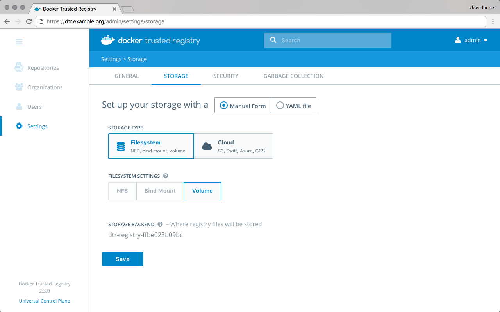

By default DTR uses the local filesystem of the node where it is running to
store your Docker images. You can configure DTR to use an external storage
backend, for improved performance or high availability.


If your DTR deployment only has a single replica, you can continue using the
local filesystem to store your Docker images. If your DTR deployment has
multiple replicas, for high availability, you need to ensure all replicas are
using the same storage backend. When a user pulls an image, the node serving
the request needs to have access to that image.

DTR supports these storage systems:

* Local filesystem
* NFS
* Amazon S3 or compatible
* Google Cloud Storage
* Microsoft Azure Blob storage
* OpenStack Swift

To configure the storage backend, you can log into the **DTR web UI**
as an administrator user, navigate to the **Settings** page, and choose
**Storage**.

{: .with-border}

The storage configuration page in the DTR web UI has options for the most
common configuration options, but you can also upload a yaml configuration file.

The format of this configuration file is similar to the one used by
[Docker Registry](/registry/configuration.md).

## Local filesystem

By default, DTR creates a volume named `dtr-registry-<replica-id>` to store
your images using the local filesystem. You can customize the name and path of
the volume used by DTR, using the `docker/dtr reconfigure --dtr-storage-volume`
option.

If you're deploying DTR with high-availability, you need to use NFS or any other
centralized storage backend so that all your DTR replicas have access to the
same images.

To check how much space your images are taking in the local filesystem, you
can ssh into the node where DTR is deployed and run:

```

# Find the path to the volume
docker volume inspect dtr-registry-<replica-id>

# Check the disk usage
sudo du -hs \
$(dirname $(docker volume inspect --format '{{.Mountpoint}}' dtr-registry-<dtr-replica>))

```

## NFS

You can configure your DTR replicas to store images on an NFS partition, so that
all replicas can share the same storage backend.

[Learn how to configure DTR with NFS](nfs.md).


## Amazon S3

DTR supports AWS3 or other storage systems that are S3-compatible like Minio.
[Learn how to configure DTR with Amazon S3](s3.md).
