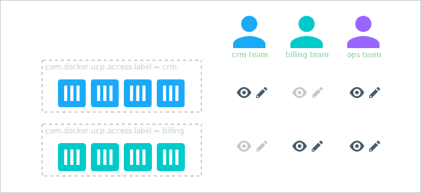

With Docker Universal Control Plane you get to control who can create and edit
resources like images, networks, volumes, and containers in your cluster.

By default no one can make changes to your cluster. You can then grant and
manage permissions to enforce fine-grained access control. For that:

* Start by creating a user and assigning them with a default permission.

    Default permissions specify the permission a user has to create and edit
    resources. You can choose from four permission levels that range from
    no access to full control over the resources.

    When a user only has a default permission assigned, only them and admin
    users can see the containers they deploy in the cluster.

* Extend the user permissions by adding users to a team.

    You can extend the user's default permissions by granting them fine-grain
    permissions over containers. You do this by adding the user to a team.
    A team defines the permissions users have for containers that have the label
    `com.docker.ucp.access.label` applied to them.

## Users and teams

When users create a container with no label, that container is only visible to
them and administrator users.
For a team of users to be able to see and edit the same container, that
container needs to have the `com.docker.ucp.access.label` label applied.

In the example above, we have two sets of containers. One set has all containers
labeled with `com.docker.ucp.access.label=crm`, the other has all containers
labeled with `com.docker.ucp.access.label=billing`.

You can now create different teams, and tune the permission level each
team has for those containers.

As an example you can create three different teams:

* The team that's developing the CRM app has access to create and edit
containers with the label `com.docker.ucp.access.label=crm`.
* The team that's developing the Billing app, has access to create and edit
containers with the label `com.docker.ucp.access.label=billing`.
* And of course, the operations team has access to create and edit containers
with any of the two labels.

## Where to go next

* [Create and manage users](create-and-manage-users.md)
* [Create and manage teams](create-and-manage-teams.md)