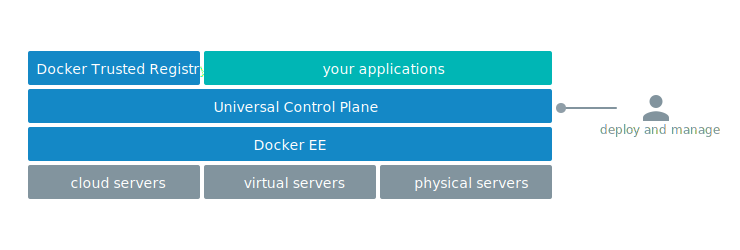
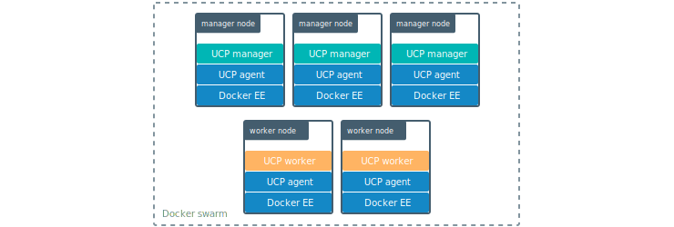
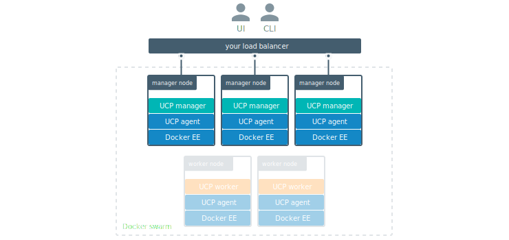

Universal Control Plane is a containerized application that runs on [Docker Enterprise Edition](/enterprise/index.md) and extends its functionality to
make it easier to deploy, configure, and monitor your applications at scale.

It also secures Docker with role-based access control so that only authorized
users can make changes and deploy applications to your Docker cluster.

Once Universal Control Plane (UCP) is deployed, developers and IT operations
no longer interact with Docker Engine directly, but interact with UCP instead.
Since UCP exposes the standard Docker API this is all done transparently, so
that you can use the tools you already know and love like the Docker CLI client
and Docker Compose.

## Under the hood

Docker UCP leverages the clustering and orchestration functionality provided
by Docker.

A swarm is a collection of nodes that are in the same Docker swarm. [Nodes](/engine/swarm/key-concepts.md) in a Docker swarm operate in one of two modes: Manager or Worker. If nodes are not already running in a swarm when installing UCP, nodes will be configured to run in swarm mode.

When you deploy UCP, it starts running a globally scheduled service called
`ucp-agent`. This service monitors the node where it is running and starts
and stops UCP services, based on whether that node is a
[manager or a worker node](/engine/swarm/key-concepts.md).

If the node is a:

* **Manager**: the `ucp-agent` service automatically starts serving all UCP
components including the UCP web UI and data stores used by UCP. The `ucp-agent` accomplishes this by [deploying several containers](#ucp-components-in-manager-nodes) on the node. By promoting a node to manager, UCP automatically becomes highly available and fault tolerant.
* **Worker**: on worker nodes the `ucp-agent` service starts serving a proxy
service that ensures only authorized users and other UCP services can run Docker
commands in that node. The `ucp-agent` only deploys a [subset of containers](#ucp-components-in-worker-nodes) on worker nodes.

## UCP internal components

The core component of UCP is a globally-scheduled service called `ucp-agent`.
When you install UCP on a node, or join a node to a swarm that is being managed
by UCP, the `ucp-agent` service starts running on that node.

Once this service is running, it deploys containers with other UCP components,
and ensures they keep running. The UCP components that are deployed
on a node depend on whether that node is a manager or a worker.

### UCP components in manager nodes

Manager nodes run all UCP services, including the web UI and data stores that
persist the state of UCP. These are the UCP services running on manager nodes:

| UCP component       | Description                                                                                                                                                                                       |
|:--------------------|:--------------------------------------------------------------------------------------------------------------------------------------------------------------------------------------------------|
| ucp-agent           | Monitors the node and ensures the right UCP services are running                                                                                                                                  |
| ucp-reconcile       | When ucp-agent detects that the node is not running the right UCP components, it starts the ucp-reconcile container to converge the node to its desired state. It is expected for the ucp-reconcile container to remain in an exited state when the node is healthy. 							  |
| ucp-auth-api        | The centralized service for identity and authentication used by UCP and DTR                                                                                                                       |
| ucp-auth-store      | Stores authentication configurations, and data for users, organizations and teams                                                                                                                 |
| ucp-auth-worker     | Performs scheduled LDAP synchronizations and cleans authentication and authorization data                                                                                                         |
| ucp-client-root-ca  | A certificate authority to sign client bundles                                                                                                                                                    |
| ucp-cluster-root-ca | A certificate authority used for TLS communication between UCP components                                                                                                                         |
| ucp-controller      | The UCP web server                                                                                                                                                                                |
| ucp-kv              | Used to store the UCP configurations. Don't use it in your applications, since it's for internal use only                                                                                         |
| ucp-metrics         | Used to collect and process metrics for a node, like the disk space available                                                                                                                     |
| ucp-proxy           | A TLS proxy. It allows secure access to the local Docker Engine to UCP components                                                                                                                 |
| ucp-swarm-manager   | Used to provide backwards-compatibility with Docker Swarm                                                                                                                                         |

### UCP components in worker nodes

Worker nodes are the ones where you run your applications. These are the UCP
services running on worker nodes:

| UCP component | Description                                                                                                                                                                                       |
|:--------------|:--------------------------------------------------------------------------------------------------------------------------------------------------------------------------------------------------|
| ucp-agent     | Monitors the node and ensures the right UCP services are running                                                                                                                                  |
| ucp-reconcile | When ucp-agent detects that the node is not running the right UCP components, it starts the ucp-reconcile container to converge the node to its desired state. It is expected for the ucp-reconcile container to remain in an exited state when the node is healthy. 							                  |
| ucp-proxy     | A TLS proxy. It allows secure access to the local Docker Engine to UCP components                                                                                                                 |

## Volumes used by UCP

Docker UCP uses these named volumes to persist data in all nodes where it runs:

| Volume name                 | Description                                                                              |
|:----------------------------|:-----------------------------------------------------------------------------------------|
| ucp-auth-api-certs          | Certificate and keys for the authentication and authorization service                    |
| ucp-auth-store-certs        | Certificate and keys for the authentication and authorization store                      |
| ucp-auth-store-data         | Data of the authentication and authorization store, replicated across managers           |
| ucp-auth-worker-certs       | Certificate and keys for authentication worker                                           |
| ucp-auth-worker-data        | Data of the authentication worker                                                        |
| ucp-client-root-ca          | Root key material for the UCP root CA that issues client certificates                    |
| ucp-cluster-root-ca         | Root key material for the UCP root CA that issues certificates for swarm members         |
| ucp-controller-client-certs | Certificate and keys used by the UCP web server to communicate with other UCP components |
| ucp-controller-server-certs | Certificate and keys for the UCP web server running in the node                          |
| ucp-kv                      | UCP configuration data, replicated across managers.                                      |
| ucp-kv-certs                | Certificates and keys for the key-value store                                            |
| ucp-metrics-data            | Monitoring data gathered by UCP                                                          |
| ucp-metrics-inventory       | Configuration file used by the ucp-metrics service                                       |
| ucp-node-certs              | Certificate and keys for node communication                                              |

You can customize the volume driver used for these volumes, by creating
the volumes before installing UCP. During the installation, UCP checks which
volumes don't exist in the node, and creates them using the default volume
driver.

By default, the data for these volumes can be found at
`/var/lib/docker/volumes/<volume-name>/_data`.

## How you interact with UCP

There are two ways to interact with UCP: the web UI or the CLI.

You can use the UCP web UI to manage your cluster, grant and revoke user
permissions, deploy, configure, manage, and monitor your applications.

UCP also exposes the standard Docker API, so you can continue using existing
tools like the Docker CLI client. Since UCP secures your cluster with role-based
access control, you need to configure your Docker CLI client and other client
tools to authenticate your requests using
[client certificates](user/access-ucp/index.md) that you can download
from your UCP profile page.

## Where to go next

* [System requirements](admin/install/system-requirements.md)
* [Plan your installation](admin/install/system-requirements.md)
