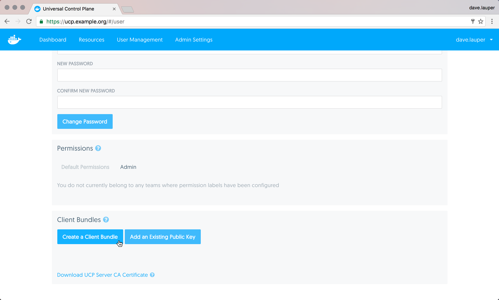

Docker UCP secures your cluster with role-based access control, so that only
authorized users can perform changes to the cluster.

For this reason, when running docker commands on a UCP node, you need to
authenticate your request using client certificates. When trying to run docker
commands without a valid certificate, you get an authentication error:

```none
$ docker ps

x509: certificate signed by unknown authority
```

There are two different types of client certificates:

* Admin user certificate bundles: allow running docker commands on the
Docker Engine of any node,
* User certificate bundles: only allow running docker commands through a UCP
manager node.

## Download client certificates

To download a client certificate bundle, log into the **UCP web UI**, and
navigate to your **user profile** page.

{: .with-border}

Click the **Create a Client Bundle** button to download the certificate bundle.


## Use client certificates

Once you've downloaded a client certificate bundle to your local computer, you
can use it to authenticate your requests.

Navigate to the directory where you downloaded the user bundle, and unzip it.
Then source the `env.sh` script.

```none
$ unzip ucp-bundle-dave.lauper.zip
$ eval $(<env.sh)
```

The `env.sh` script updates the `DOCKER_HOST` environment variable to make your
local Docker CLI communicate with UCP. It also updates the `DOCKER_CERT_PATH`
environment variable to use the client certificates that are included in the
client bundle you downloaded.

To verify a client certificate bundle has been loaded and the client is
successfully communicating with UCP, look for `ucp` in the `Server Version`
returned by `docker version`.

```bash

$ docker version --format '{{.Server.Version}}'

ucp/2.1.0
```

From now on, when you use the Docker CLI client, it includes your client
certificates as part of the request to the Docker Engine.
You can now use the Docker CLI to create services, networks, volumes, and other
resources on a swarm managed by UCP.

## Download client certificates using the REST API

You can also download client bundles using the UCP REST API. In
this example we'll be using `curl` for making the web requests to the API, and
`jq` to parse the responses.

To install these tools on a Ubuntu distribution, you can run:

```none
$ sudo apt-get update && sudo apt-get install curl jq
```

Then you get an authentication token from UCP, and use it to download the
client certificates.

```none
# Create an environment variable with the user security token
$ AUTHTOKEN=$(curl -sk -d '{"username":"<username>","password":"<password>"}' https://<ucp-ip>/auth/login | jq -r .auth_token)

# Download the client certificate bundle
$ curl -k -H "Authorization: Bearer $AUTHTOKEN" https://<ucp-ip>/api/clientbundle -o bundle.zip
```

## Where to go next

* [Access the UCP web UI](index.md)
