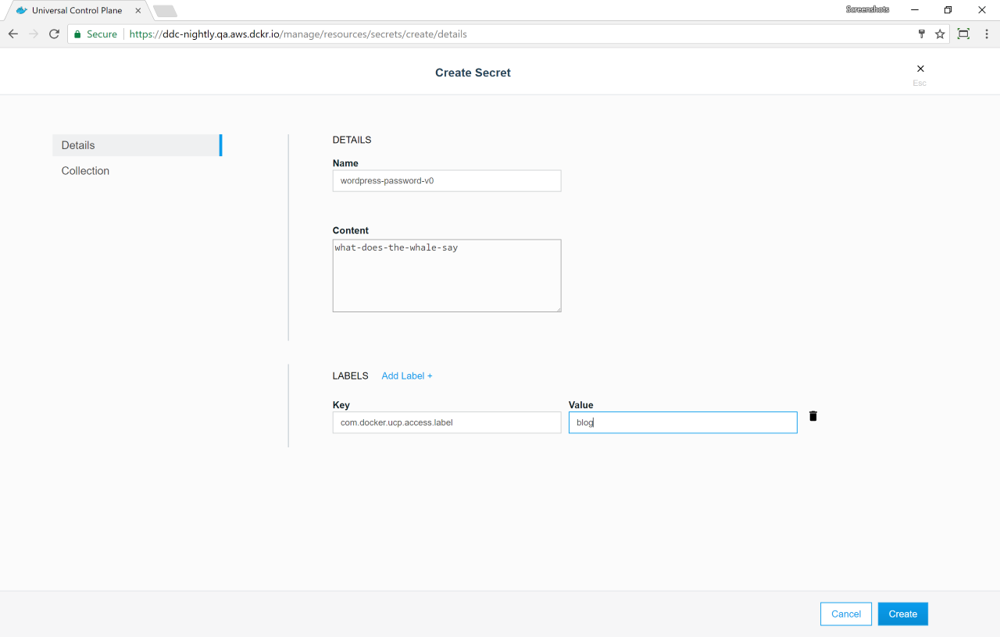

UCP gives you access control, so that you can specify which users can use a
specific secret in their services and which users can delete the secret.

## Grant access to a secret

As with other resources managed by UCP, the way to give permission to a set
of users to use a secret is by applying the `com.docker.ucp.access.label` to
the secret.

{: .with-border}

Users that are part of a team with access to that label will be able to see
and use the secret.

In this example, if Jenny is part of a team that has `Restricted Control` over
the `com.docker.ucp.access.label=blog` label, she will be able to use the
secret in her services, as long as the service also has the same label.

This ensures that users can use a secret in their services without having
permissions to attach to the container running the service and inspect the
secret data.

To revoke access to a secret you can edit the secret to change the access label,
or update the permissions a team has for a label.

## Where to go next

* [Manage secrets](index.md)
