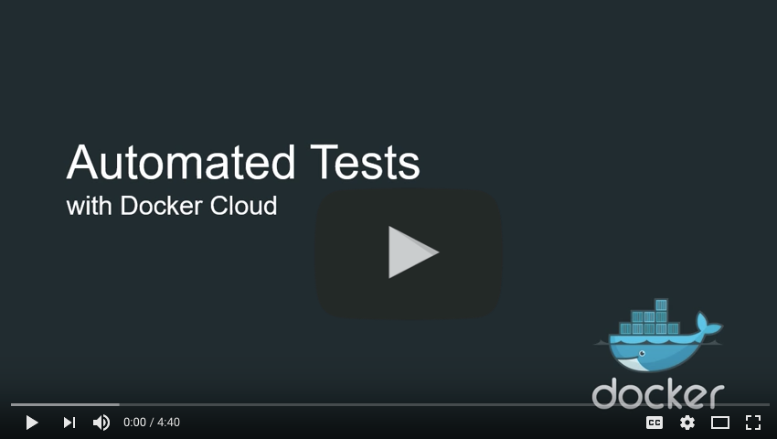

[](https://www.youtube.com/watch?v=KX6PD2MANRI "Automated Tests with Docker Cloud"){:target="_blank" class="_"}

Docker Cloud can automatically test changes to your source code repositories
using containers. You can enable `Autotest` on [any Docker Cloud repository](repos.md) to run tests on each pull request to the source code
repository to create a continuous integration testing service.

Enabling `Autotest` builds an image for testing purposes, but does **not**
automatically push the built image to the Docker repository. If you want to push
built images to your Docker Cloud repository, enable [Automated Builds](automated-build.md).

## Set up automated test files

To set up your automated tests, create a `docker-compose.test.yml` file which
defines a `sut` service that lists the tests to be run. This file has a structure 
similar to the [docker-cloud.yml](https://docs.docker.com/docker-cloud/apps/stack-yaml-reference/).
The `docker-compose.test.yml` file should be located in the same directory that
contains the Dockerfile used to build the image.

For example:

```none
sut:
  build: .
  command: run_tests.sh
```

The example above builds the repository, and runs the `run_tests.sh` file inside
a container using the built image.

You can define any number of linked services in this file. The only requirement
is that `sut` is defined. Its return code determines if tests passed or not.
Tests **pass** if the `sut` service returns `0`, and **fail** otherwise.

> **Note**: Only the `sut` service and all other services listed in `depends_on`
are started. For instance, if you have services that poll for changes in other
services, be sure to include the polling services in the `depends_on` list to
make sure all of your services start.

You can define more than one `docker-compose.test.yml` file if needed. Any file
that ends in `.test.yml` is used for testing, and the tests run sequentially.
You can also use [custom build
hooks](advanced.md#override-build-test-or-push-commands) to further customize
your test behavior.

> **Note**: If you enable Automated builds, they will also run any tests defined
in the `test.yml` files.

## Enable automated tests on a repository

To enable testing on a source code repository, you must first create an
associated build-repository in Docker Cloud.  Your `Autotest` settings are
configured on the same page as [automated builds](automated-build.md), however
you do not need to enable Autobuilds to use `Autotest`. Autobuild is enabled per
branch or tag, and you do not need to enable it at all.

Only branches that are configured to use **Autobuild** will push images to the
Docker repository, regardless of the Autotest settings.

1. Log in to Docker Cloud and select **Repositories** in the left navigation.

3. Select the repository you want to enable `Autotest` on.

4. From the repository view, click the **Builds** tab.

4. Click **Configure automated builds**.

5. Configure the automated build settings as explained in [Automated Builds](automated-build.md).

    At minimum you must configure:

    * The source code repository
    * the build location
    * at least one build rule

8. Choose your **Autotest** option.

    The following options are available:

    * `Off`: No additional test builds. Tests only run if they're configured
    as part of an automated build.

    * `Internal pull requests`: Run a test build for any pull requests
    to branches that match a build rule, but only when the pull request comes
    from the same source repository.

    * `Internal and external pull requests`: Run a test build for any
    pull requests to branches that match a build rule, including when the
    pull request originated in an external source repository.

    > **Note**: For security purposes, autotest on _external pull requests_ is
    limited on public repositories. Private images will not be pulled and
    environment  variables defined in Docker Cloud will not be
    available. Automated builds will  continue to work as usual.

9. Click **Save** to save the settings, or click **Save and build** to save and
run an initial test.

## Check your test results

From the repository's details page, click **Timeline**.

From this tab you can see any pending, in-progress, successful, and failed
builds and test runs for the repository.

You can click any timeline entry to view the logs for each test run.
