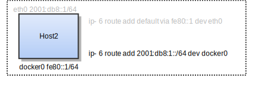
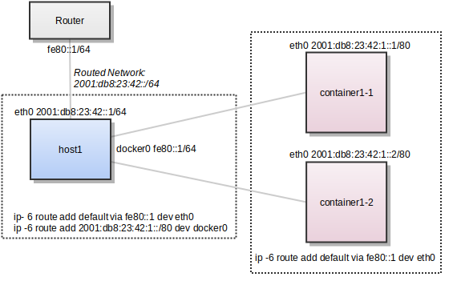
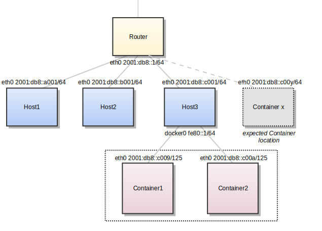
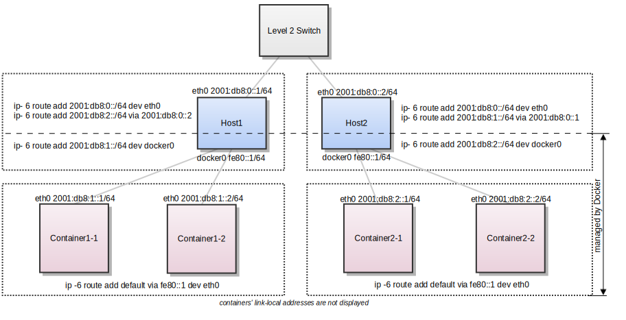
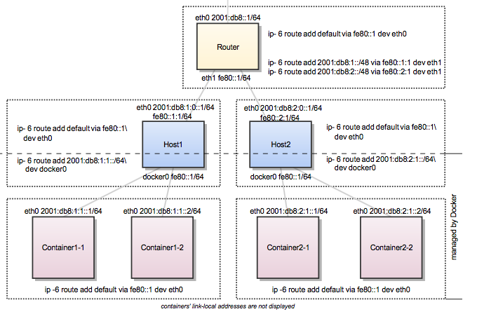

The information in this section explains IPv6 with the Docker default bridge.
This is a `bridge` network named `bridge` created automatically when you install
Docker.

As we are [running out of IPv4
addresses](http://en.wikipedia.org/wiki/IPv4_address_exhaustion) the IETF has
standardized an IPv4 successor, [Internet Protocol Version
6](http://en.wikipedia.org/wiki/IPv6) , in [RFC
2460](https://www.ietf.org/rfc/rfc2460.txt). Both protocols, IPv4 and IPv6,
reside on layer 3 of the [OSI model](http://en.wikipedia.org/wiki/OSI_model).

## How IPv6 works on Docker

By default, the Docker daemon configures the container network for IPv4 only.
You can enable IPv4/IPv6 dualstack support by running the Docker daemon with the
`--ipv6` flag. Docker will set up the bridge `docker0` with the IPv6 [link-local
address](http://en.wikipedia.org/wiki/Link-local_address) `fe80::1`.

By default, containers that are created will only get a link-local IPv6 address.
To assign globally routable IPv6 addresses to your containers you have to
specify an IPv6 subnet to pick the addresses from. Set the IPv6 subnet via the
`--fixed-cidr-v6` parameter when starting Docker daemon:

You can run `dockerd` with these flags directly, but it is recommended that you
set them in the
[`daemon.json`](/engine/reference/commandline/dockerd.md#daemon-configuration-file)
configuration file instead. The following example `daemon.json` enables IPv6 and
sets the IPv6 subnet to `2001:db8:1::/64`.

```json
{
  "ipv6": true,
  "fixed-cidr-v6": "2001:db8:1::/64"
}
```

The subnet for Docker containers should at least have a size of `/80`, so that
an IPv6 address can end with the container's MAC address and you prevent NDP
neighbor cache invalidation issues in the Docker layer.

By default, `--fixed-cidr-v6` parameter causes Docker to add a new route to the
routing table, by basically running the three commands below on your behalf. To
prevent the automatic routing, set `ip-forward` to `false` in the `daemon.json`
file or start the Docker daemon with the `--ip-forward=false` flag. Then, to get
the same routing table that Docker would create automatically for you, issue the
following commands:

```bash
$ ip -6 route add 2001:db8:1::/64 dev docker0

$ sysctl net.ipv6.conf.default.forwarding=1

$ sysctl net.ipv6.conf.all.forwarding=1
```

All traffic to the subnet `2001:db8:1::/64` will now be routed via the `docker0`
interface.

> **Note**: IPv6 forwarding may interfere with your existing IPv6
> configuration: If you are using Router Advertisements to get IPv6 settings for
> your host's interfaces, set `accept_ra` to `2` using the following command.
> Otherwise IPv6 enabled forwarding will result in rejecting Router Advertisements.
>
>    $ sysctl net.ipv6.conf.eth0.accept_ra=2



Every new container will get an IPv6 address from the defined subnet, and a
default route will be added on `eth0` in the container via the address specified
by the daemon option `--default-gateway-v6` (or `default-gateway-v6` in
`daemon.json`) if present. The default gateway defaults to `fe80::1`.

This example provides a way to examine the IPv6 network settings within a
running container.

```bash
docker run -it alpine ash -c "ip -6 addr show dev eth0; ip -6 route show"

15: eth0: <BROADCAST,UP,LOWER_UP> mtu 1500
   inet6 2001:db8:1:0:0:242:ac11:3/64 scope global
      valid_lft forever preferred_lft forever
   inet6 fe80::42:acff:fe11:3/64 scope link
      valid_lft forever preferred_lft forever

2001:db8:1::/64 dev eth0  proto kernel  metric 256
fe80::/64 dev eth0  proto kernel  metric 256
default via fe80::1 dev eth0  metric 1024
```

In this example, the container is assigned a link-local address with the subnet
`/64` (`fe80::42:acff:fe11:3/64`) and a globally routable IPv6 address
(`2001:db8:1:0:0:242:ac11:3/64`). The container will create connections to
addresses outside of the `2001:db8:1::/64` network via the link-local gateway at
`fe80::1` on `eth0`.

Often servers or virtual machines get a `/64` IPv6 subnet assigned (e.g.
`2001:db8:23:42::/64`). In this case you can split it up further and provide
Docker a `/80` subnet while using a separate `/80` subnet for other applications
on the host:



In this setup the subnet `2001:db8:23:42::/64` with a range from
`2001:db8:23:42:0:0:0:0` to `2001:db8:23:42:ffff:ffff:ffff:ffff` is attached to
`eth0`, with the host listening at `2001:db8:23:42::1`. The subnet
`2001:db8:23:42:1::/80` with an address range from `2001:db8:23:42:1:0:0:0` to
`2001:db8:23:42:1:ffff:ffff:ffff` is attached to `docker0` and will be used by
containers.

### Using NDP proxying

If your Docker host is the only part of an IPv6 subnet but does not have an IPv6
subnet assigned, you can use NDP proxying to connect your containers to the
internet via IPv6. If the host with IPv6 address `2001:db8::c001` is part of
the subnet `2001:db8::/64` and your IaaS provider allows you to
configure the IPv6 addresses `2001:db8::c000` to `2001:db8::c00f`, your network
configuration may look like the following:

```bash
$ ip -6 addr show

1: lo: <LOOPBACK,UP,LOWER_UP> mtu 65536
    inet6 ::1/128 scope host
       valid_lft forever preferred_lft forever
2: eth0: <BROADCAST,MULTICAST,UP,LOWER_UP> mtu 1500 qlen 1000
    inet6 2001:db8::c001/64 scope global
       valid_lft forever preferred_lft forever
    inet6 fe80::601:3fff:fea1:9c01/64 scope link
       valid_lft forever preferred_lft forever
```

To slit up the configurable address range into two subnets
`2001:db8::c000/125` and `2001:db8::c008/125`, use the following `daemon.json`
settings. The first subnet will be used by non-Docker processes on the host, and
the second will be used by Docker.

```json
{
  "ipv6": true,
  "fixed-cidr-v6": "2001:db8::c008/125"
}
```

The Docker subnet is within the subnet managed by your router and connected to
`eth0`. All containers with addresses assigned by Docker are expected to be
found within the router subnet, and the router can communicate with these
containers directly.



When the router wants to send an IPv6 packet to the first container, it
transmits a _neighbor solicitation request_, asking "Who has `2001:db8::c009`?"
However, no host on the subnet has the address; the container with the address
is hidden behind the Docker host. The Docker host therefore must listen for
neighbor solicitation requests and respond that it is the device with the
address. This functionality is called the _NDP Proxy_ and is handled by the kernel
on the host machine. To enable the NDP proxy, execute the following command:

```bash
$ sysctl net.ipv6.conf.eth0.proxy_ndp=1
```

Next, add the container's IPv6 address to the NDP proxy table:

```bash
$ ip -6 neigh add proxy 2001:db8::c009 dev eth0
```

From now on, the kernel answers neighbor solicitation addresses for this address
on the device `eth0`. All traffic to this IPv6 address is routed through the
Docker host, which will forward it to the container's network according to its
routing table via the `docker0` device:

```bash
$ ip -6 route show

2001:db8::c008/125 dev docker0  metric 1
2001:db8::/64 dev eth0  proto kernel  metric 256
```

You have to execute the `ip -6 neigh add proxy ...` command for every IPv6
address in your Docker subnet. Unfortunately there is no functionality for
adding a whole subnet by executing one command. An alternative approach would be
to use an NDP proxy daemon such as
[ndppd](https://github.com/DanielAdolfsson/ndppd).

## Docker IPv6 cluster

### Switched network environment
Using routable IPv6 addresses allows you to realize communication between
containers on different hosts. Let's have a look at a simple Docker IPv6 cluster
example:



The Docker hosts are in the `2001:db8:0::/64` subnet. Host1 is configured to
provide addresses from the `2001:db8:1::/64` subnet to its containers. It has
three routes configured:

- Route all traffic to `2001:db8:0::/64` via `eth0`
- Route all traffic to `2001:db8:1::/64` via `docker0`
- Route all traffic to `2001:db8:2::/64` via Host2 with IP `2001:db8::2`

Host1 also acts as a router on OSI layer 3. When one of the network clients
tries to contact a target that is specified in Host1's routing table Host1 will
forward the traffic accordingly. It acts as a router for all networks it knows:
`2001:db8::/64`, `2001:db8:1::/64`, and `2001:db8:2::/64`.

On Host2 we have nearly the same configuration. Host2's containers will get IPv6
addresses from `2001:db8:2::/64`. Host2 has three routes configured:

- Route all traffic to `2001:db8:0::/64` via `eth0`
- Route all traffic to `2001:db8:2::/64` via `docker0`
- Route all traffic to `2001:db8:1::/64` via Host1 with IP `2001:db8:0::1`

The difference to Host1 is that the network `2001:db8:2::/64` is directly
attached to Host2 via its `docker0` interface whereas Host2 reaches
`2001:db8:1::/64` via Host1's IPv6 address `2001:db8::1`.

This way every container is able to contact every other container. The
containers `Container1-*` share the same subnet and contact each other directly.
The traffic between `Container1-*` and `Container2-*` will be routed via Host1
and Host2 because those containers do not share the same subnet.

In a switched environment every host has to know all routes to every subnet.
You always have to update the hosts' routing tables once you add or remove a
host to the cluster.

Every configuration in the diagram that is shown below the dashed line is
handled by Docker: The `docker0` bridge IP address configuration, the route to
the Docker subnet on the host, the container IP addresses and the routes on the
containers. The configuration above the line is up to the user and can be
adapted to the individual environment.

### Routed network environment
In a routed network environment you replace the layer 2 switch with a layer 3
router. Now the hosts just have to know their default gateway (the router) and
the route to their own containers (managed by Docker). The router holds all
routing information about the Docker subnets. When you add or remove a host to
this environment you just have to update the routing table in the router - not
on every host.



In this scenario containers of the same host can communicate directly with each
other. The traffic between containers on different hosts will be routed via
their hosts and the router. For example packet from `Container1-1` to
`Container2-1` will be routed through `Host1`, `Router`, and `Host2` until it
arrives at `Container2-1`.

To keep the IPv6 addresses short in this example a `/48` network is assigned to
every host. The hosts use a `/64` subnet of this for its own services and one
for Docker. When adding a third host you would add a route for the subnet
`2001:db8:3::/48` in the router and configure Docker on Host3 with
`--fixed-cidr-v6=2001:db8:3:1::/64`.

Remember the subnet for Docker containers should at least have a size of `/80`.
This way an IPv6 address can end with the container's MAC address and you
prevent NDP neighbor cache invalidation issues in the Docker layer. So if you
have a `/64` for your whole environment use `/76` subnets for the hosts and
`/80` for the containers. This way you can use 4096 hosts with 16 `/80` subnets
each.

Every configuration in the diagram that is visualized below the dashed line is
handled by Docker: The `docker0` bridge IP address configuration, the route to
the Docker subnet on the host, the container IP addresses and the routes on the
containers. The configuration above the line is up to the user and can be
adapted to the individual environment.
