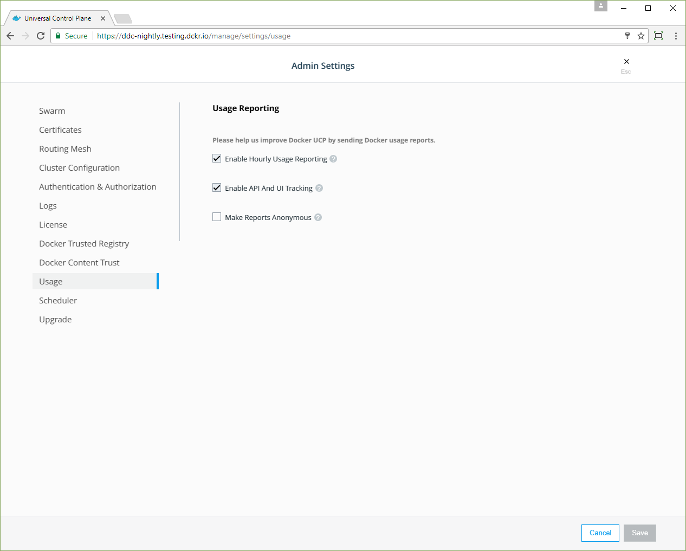

Docker EE version 17.06 and later includes a telemetry plugin. The plugin is enabled by default on Ubuntu starting with Docker EE 17.06.0 and on the rest of the EE-supported Linux distributions starting with version 17.06.2-ee-5. The telemetry plugin is not part of Docker EE for Windows Server.

The telemetry plugin sends system information to Docker Inc. Docker uses this information to improve Docker EE. For details about the telemetry plugin and the types of data it collects, see the
[`telemetry` plugin documentation](https://store.docker.com/community/images/docker/telemetry).

If your Docker instance runs in an environment with no internet connectivity,
the telemetry plugin does not collect or attempt to send any information to Docker Inc.

## Manage data collection

If you do not wish to send any usage data to Docker Inc., you can disable the plugin,
either using the Docker CLI or using Universal Control Plane.

 > **Note**: If you're using Docker EE Standard or Advanced with Universal Control Plane, use Universal Control Plane (UCP) to enable and disable metrics. Only use the CLI if you do not have UCP. UCP will re-enable the telemetry plugin for hosts where it was disabled with the CLI.

### Use the Docker CLI

To disable the telemetry plugin, use the `docker plugin disable` with either the plugin NAME or ID:

```bash
$ docker plugin ls
ID                  NAME                                           [..]
114dbeaa400c        docker/telemetry:1.0.0.linux-x86_64-stable     [..]

$ docker plugin disable docker/telemetry:1.0.0.linux-x86_64-stable
```

This command must be run on each Docker host.

To re-enable the telemetry plugin, you can use `docker plugin enable` with either the plugin NAME or ID:

```bash
$ docker plugin ls
ID                  NAME                                           [..]
114dbeaa400c        docker/telemetry:1.0.0.linux-x86_64-stable     [..]

$ docker plugin enable docker/telemetry:1.0.0.linux-x86_64-stable
```

### Use Universal Control Plane

If you use Universal Control Plane with Docker EE, do not use the Docker CLI to
disable the telemetry plugin. Instead, you can manage the information sent to
Docker by going to **Admin Settings** and choosing **Usage**.

{: .with-border}

To disable the telemetry plugin, disable all three options and click **Save**.
Enabling either or both of the top two options will enable the telemetry plugin.
You can find out more about an individual option by clicking the **?** icon.

> **Note**: If API usage statistics are enabled, Docker only gathers aggregate stats about what API endpoints are used. API payload contents are not collected.

