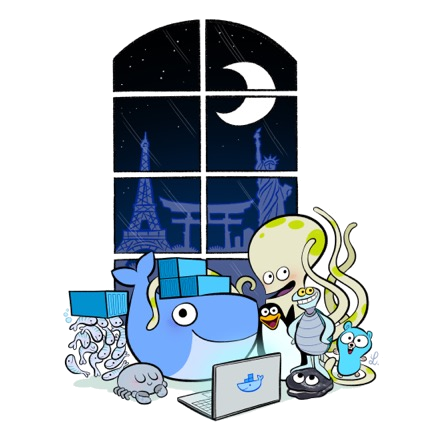

Beyond the documentation contributions we cover here, there are many other ways
to contribute to Docker. Whether you are just getting started or are expert in
your field, you have a unique perspective that is a valuable resource to share
with others. The Docker community, meetups, mentoring, and open source projects
all need your participation, ideas, feedback, and vision.

* [Organize a Docker meetup](#organize-a-docker-meetup)
* [Learn about the Docker Community](#learn-about-the-docker-community)
* [Contribute to the Moby open source project](#contribute-to-the-moby-open-source-project)

## Organize a Docker meetup

Anyone interested in Docker can become an active member of the Docker community
by becoming a co-organizer of a Docker Meetup group.

If a Meetup group does not already exist in your area and you are willing to
start a new one, the best way to proceed is to contact us so that we can create
it for you. We will always agree to create a new Docker Meetup group as long as
it makes sense geographically speaking.

If you have already created a Docker Meetup group that is fine, we will simply
ask you to add us as a co-organizer so that we can ensure a consistent support
to the group in terms of community and Meetup management.

Before contacting us to create a new Docker Meetup Group, take a look at our
Meetup Groups page to make sure a group does not already exist in the area.

### Get started putting on a Docker Meetup

Now that you are a co-organizer of a Docker Meetup Group, here are a few tips and
suggestions to help you get started:

* Attend similar DevOps or Developers Meetups to gain experience and gauge interest in Docker
* Contact other people interested in Docker to help you organize and promote future Meetups
* Research High-Tech companies in your area willing to host a Docker Meetup event
* Research what would be the best date(s) to schedule the Meetups based on availabilities with regard to competing events in the area and other calendar imperative
* Research what are the topic of interest to your audience prior to set an agenda for the meetup
* Pay attention to the Meetup page aesthetics, add logos and pictures, invite members to leave comments and reply to these comments
* Promote the event on social media and make sure that the list of keywords is well define if you have created the Docker Meetup Group on your own

### How Docker can help you organize

We can support the co-organizers of the Docker Meetup Groups based on their specific needs. For instance, we might / will be able to:

* Send you Docker T-shirts and stickers
* Put you in contact with other people interested in being a co-organizer of a Docker Meetup group, and which are in the same area
* Put you in contact with companies willing to host a Docker Meetup in your area
* Introduce you to people willing to give a lightning talk about Docker
* Promote your Docker Group on Docker.com, Docker Weekly and Social Media
  Hackday Picture

### Host a Docker meetup at your location

### Want to host a Docker Meetup?

We are always looking for new office space to host Docker Meetups. If your
company is willing to host a Docker Meetup, please contact us by email at
meetup@docker.com. Previous Docker Meetups have been hosted by companies such
as Rackspace, Twitter, MongoDB, BrightCove, DigitalOcean, Viadeo and Edmodo.
#### How many attendees?

The company hosting the event fixes the number of attendees depending on their
office size and availability. This number usually varies between 30 and 200.

#### How long is a Docker Meetup?

Once again, each company hosting the event decides when does the meetup start,
and how long it lasts. Usual meetups tend to last 2 hours, and start between
4pm and 6pm.

## Learn about the Docker Community

Go to the **[Docker Community GitHub
repository](https://github.com/docker/community/blob/master/README.md){:
target="_blank" class="_"}** for
resources and information on the community. Those pages are the most
up-to-date for finding out about the community and making connections.

The topics below provide some additional links, but it's likely that everything
you need will be on the GitHub repository.

### Become a Mentor

With millions of Docker users all over the world, there's always someone who
needs a helping hand. Like many open source projects, the Docker project relies
on community support channels like forums, IRC, and StackOverflow.  You should
contribute mentoring if you have good knowledge of:

* how open source projects run
* using Docker in some particular domain (for example, testing or deployment)
* using Git, Go, GitHub, IRC, or other common tools

Also, choose mentoring if you like to be happy. Studies show that [helping others](http://www.huffingtonpost.com/2013/09/03/five-minute-favor-adam-rifkin_n_3805090.html){: target="_blank" class="_"} is a great way to
boost your own well being.

### Docker users

Docker users are people using Docker in their daily work. To help Docker users, visit:

* the [Docker Community Forum](https://forums.docker.com/){: target="_blank" class="_"}
* the `#docker` channel on Freenode IRC
* [StackOverflow](http://stackoverflow.com/search?tab=newest&q=docker){: target="_blank" class="_"}

You can also check the lists of [open issues on the Docker docs](https://github.com/docker/docker.github.io/issues){: target="_blank" class="_"} and [open issues on the Moby project](https://github.com/moby/moby/issues?q=is%3Aopen+is%3Aissue+label%3Akind%2Fquestion+-label%3Astatus%2Fclaimed+-label%3Astatus%2Fassigned+no%3Aassignee){: target="_blank" class="_"}.

### Docker contributors

Docker contributors are people like you, interested in the open source projects
and product documentation. Contributors may need help with IRC, Go programming,
Markdown, or with other aspects of contributing. To help Docker contributors,
visit:

* the [Docker Gitter IM](https://gitter.im/docker/docker){: target="_blank" class="_"} room
* the [Google group](https://groups.google.com/forum/#!forum/docker-dev){: target="_blank" class="_"}
* the `#docker-dev` channel on Freenode IRC

## Contribute to the Moby open source project


